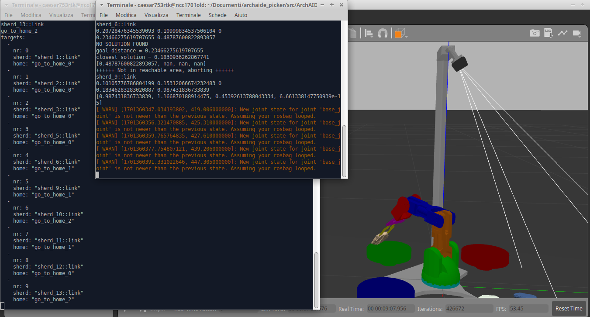

# Automatic Recognition of Sherds with ArchAIDE AI and Braccio Pick+Drop Simulation with ROS MoveIt and Gazebo

This is a standalone simulation of a Tinkerkit Braccio arm based on [lots-of-things repository](https://github.com/lots-of-things/braccio_moveit_gazebo), it runs with ROS Noetic and Python3: in the scene there are the arm and three boxes which (cylindrical bowls) in which will be put the sherds/objects created by the script `auto_main.py`.

The script reads and segments an image which can be stored on PC or can be acquired through a camera (in our development an Intel RealSense D415 Camera) in which there are some pottery sherds, at the bottom is really important to be a 10-cm long meter with a chessboard pattern (tipically used for measurement in archaeological photogrammetry): they are recognized by a trained CNN based on the ArchAIDE project (http://www.archaide.eu/) and each of them is associated to a class with an accuracy metric, this information with the center and the dimension of the sherd are stored and then processed to choose the three most representative classes whose sherds will be picked and put in the bowls.

## Installation

### Prequisities
*  Tested on ROS NOETIC
*  Required Packages:
```
sudo apt-get install ros-noetic-gazebo-ros-pkgs 
sudo apt-get install ros-noetic-gazebo-ros-control
sudo apt-get install ros-noetic-moveit
```

### Download and build source
```
mkdir -p archaide_braccio_picker/src
cd archaide_braccio_picker/src
git@github.com:caesar753/ArchAIDE_braccio_picker.git
cd ..
catkin build
```

## Usage

### Launch the programs

Start up two bash terminal sessions and navigate to the workspace directory (`archaide_braccio_picker` above).

In the first terminal run the following to bring up the Gazebo simulation.
```
source devel/setup.bash
roslaunch braccio_moveit_gazebo camera_and_mount_and_braccio.launch
```

Gazebo should open with a scene that contains the robot, the camera and its mounting and the bowls.  You may need to reposition the display camera to see everything.


In the second terminal run this to bring up the command line control interface
```
source devel/setup.bash
cd src/ArchAIDE_braccio_picker/braccio_moveit_gazebo/scripts
rosrun braccio_moveit_gazebo auto_main.py
```

### Recognition of image, creation and selection of the sherds

The program will ask you if you want to use an image stored in the folder or to take an image from a camera attached to the pc, the image MUST contain a chessboard meter of 100mm lenght at the bottom (you can use `img005DSC02101.jpg` which is located in `scripts` folder) and the trained CNN (you can use `202303161221_resnet50.pth` located in the same folder) and if you want to display the image with recognition information (choose `y/n`).


After a few seconds some sherd meshes with different colors will show on the scene, the colors are based on the assigned class, in the terminal in which you launched the script some information will be displayed (center of sherd in pixels and mm, class). When all the sherd are created the message with all the information for each sherd is publish on `/targets` topic.


In another terminal you can launch the script which subscribes to the `/targets` message, picks the fragments of the choosen classes and puts them in the assigned bowl.

```
source devel/setup.bash
cd src/ArchAIDE_braccio_picker/braccio_moveit_gazebo/scripts
rosrun braccio_moveit_gazebo targetter_subscriber.py
```





This is a short video to illustrate how the arm works


## Learn more

In [original lots-of-things repository](https://github.com/lots-of-things/braccio_moveit_gazebo) there is a more elaborate [blog post](#), that explains the internals in more detail. It covers the inverse kinematics solution, Gazebo+Moveit URDF setup, and Gazebo physics engine fine-tuning.

The original lots-of-things repository](https://github.com/lots-of-things/braccio_moveit_gazebo) is a subtask in the creation of my [`su_chef` project](https://bonkerfield.org/su_chef/), an open-source, automated food prep assistant.

## Contact

For bugs, you can file [an issue](https://github.com/caesar753/ArchAIDE_braccio_picker/issues) and I'll take a look.

## Credits
